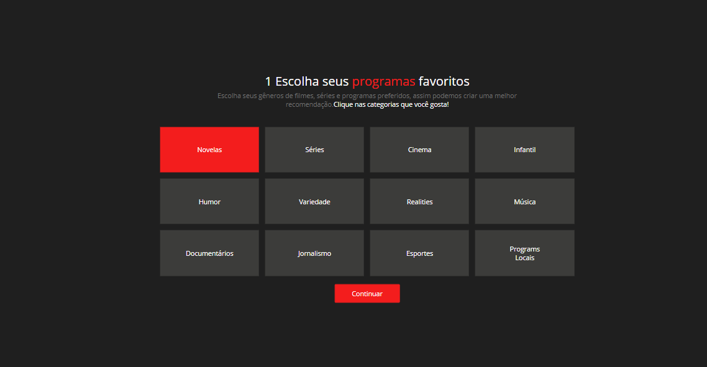
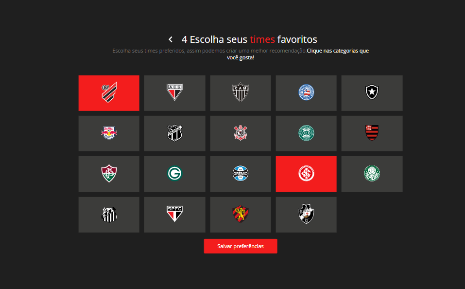
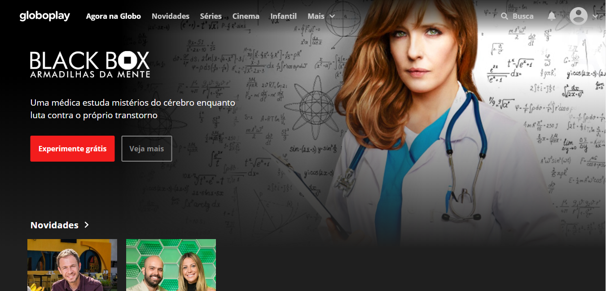
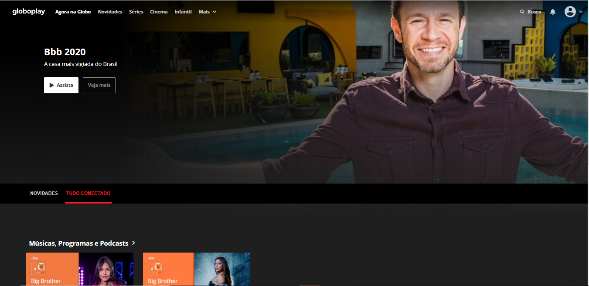

O "TUDO CONECTADO" é uma feature que poderá ser adicionada em todos as plataformas GLOBO, fazendo com que possa ser criada recomendação personalizada para o usuário de tudo que ele gosta que esteja relacionado ao conteúdo que esteja consumindo, gerando integração das plataformas, interativiade e engajamento.

✨Utilizamos libs como:

- styled-components
- react-icons
- polished
- axios
- react-router

**Personalização**

**Personalização de outros produtos**

**Página principal**

**Exemplo BBB com TUDO CONECTADO**

**Exemplo GLOBOESPORTE com TUDO CONECTADO**

